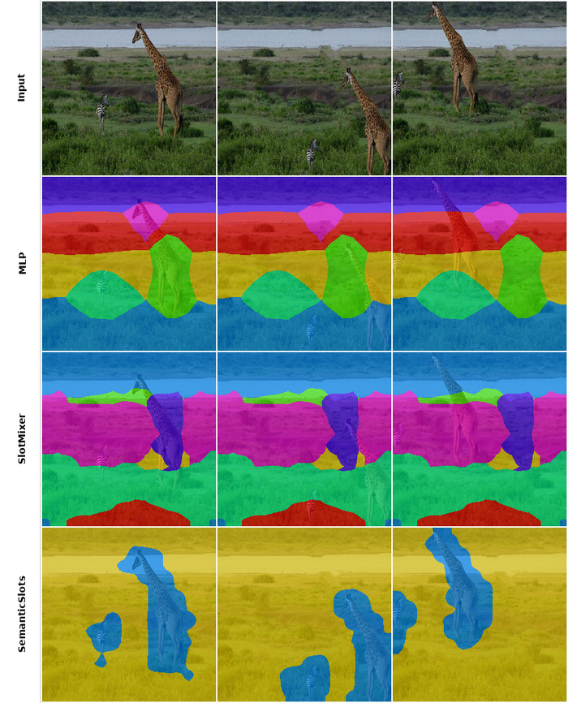
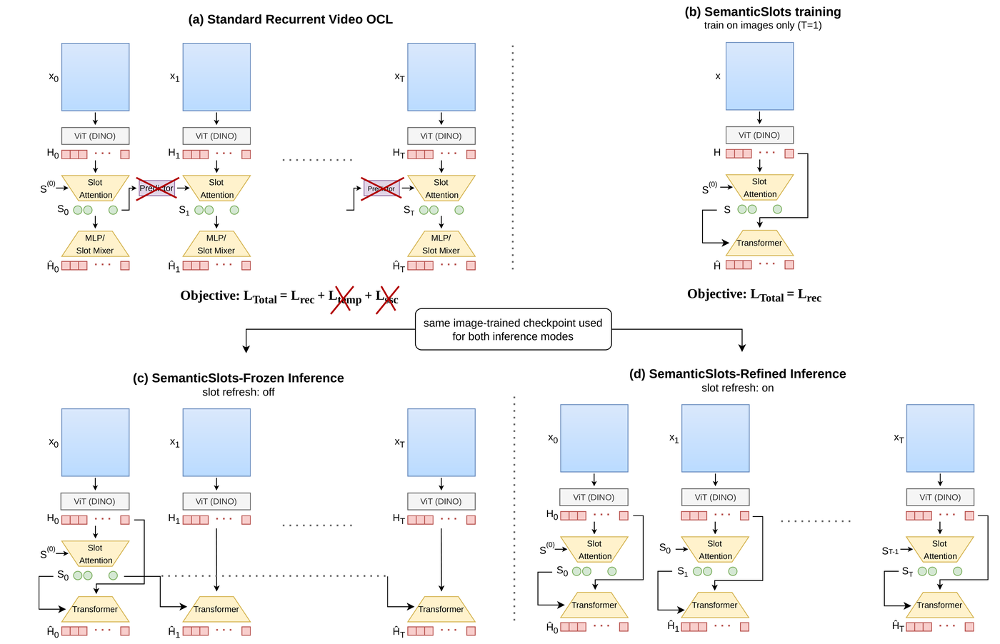
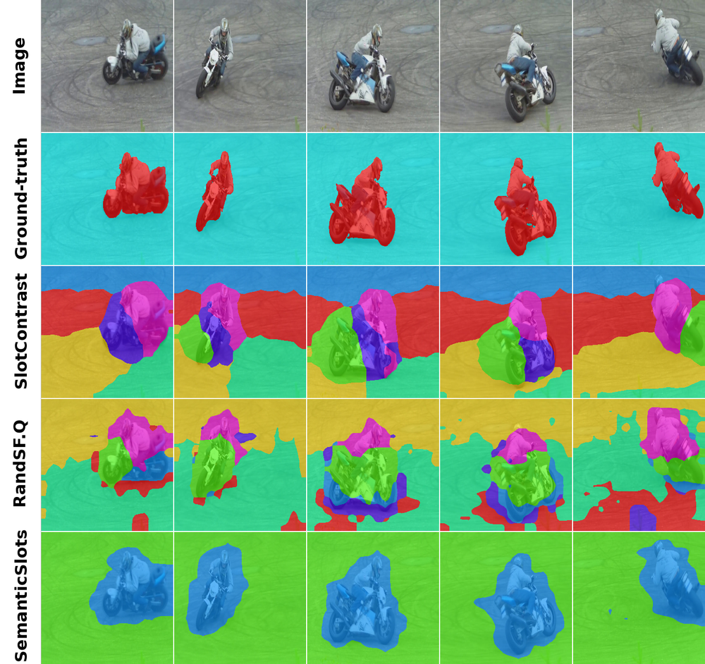

# Semantic Slots for Video Object-Centric Learning

[](https://arxiv.org/abs/2608.21636)
[](https://arxiv.org/abs/2608.21636)
[](LICENSE)

**Khalil Sabri, Guillaume-Alexandre Bilodeau, Nicolas Saunier, Wassim Bouachir**
Polytechnique Montréal, Université TÉLUQ

Official code for the BMVC 2026 paper *Semantic Slots for Video Object-Centric Learning*.

Video object-centric models usually carry slots from frame to frame with a predictor and temporal losses. We show that the decoder is the bottleneck. When the decoder can read the features of the frame it reconstructs, slots no longer need to store where an object is, only what it is. A slot computed on one frame then finds the same object in later frames. SemanticSlots is trained on single images with a reconstruction loss only. It has no predictor and no temporal loss, and it sets a new state of the art on YouTube-VIS.

<p align="center"></p>
<p align="center"><i>Slots computed on the original image decode a shifted copy. Context-free decoders (MLP, SlotMixer) reconstruct objects where they were. Our decoder finds them where they are.</i></p>

## Method

<p align="center"></p>

Training uses one frame at a time: frozen DINO features, Slot Attention, and the autoregressive Transformer decoder of DINOSAUR. At test time the same checkpoint runs in three modes:

- **Refined** (default): Slot Attention on every frame, starting from the slots of the previous frame.
- **Frozen**: Slot Attention on the first frame only. Its slots decode the whole video.
- **Adaptive**: Frozen, but slots are updated on frames that show content the first-frame slots do not explain.

Masks are the argmax of the decoder cross-attention over slots. On YTVIS the 7 initial slots are sampled from a learned Gaussian. On MOVi, as for the RandSF.Q baselines, they are initialized from the object boxes of the first frame (11 slots on MOVi-C, 21 on MOVi-D).

## Results

Object discovery, averaged over three training runs. Baselines are from [RandSF.Q](https://github.com/Genera1Z/RandSF.Q).

| YTVIS | ARI | ARI<sub>fg</sub> | mBO | mIoU |
|---|---|---|---|---|
| VideoSAUR | 34.4 | 48.9 | 31.4 | 30.9 |
| SlotContrast | 38.1 | 48.8 | 34.5 | 34.4 |
| RandSF.Q (tsim) | 46.8 | 60.7 | 41.5 | 40.6 |
| RandSF.Q (ssc) | 41.5 | 58.9 | 39.4 | 39.0 |
| **SemanticSlots** | **86.6** | **77.5** | **62.8** | **60.5** |

| MOVi-C / MOVi-D | ARI | ARI<sub>fg</sub> | mBO | mIoU | ARI | ARI<sub>fg</sub> | mBO | mIoU |
|---|---|---|---|---|---|---|---|---|
| VideoSAUR | 41.9 | 53.3 | 16.1 | 14.8 | – | – | – | – |
| SlotContrast | 64.6 | 59.9 | 27.7 | 25.8 | 45.3 | 63.9 | 26.7 | 25.1 |
| RandSF.Q (tsim) | 64.0 | 66.3 | 28.4 | 26.1 | 41.2 | 72.0 | 27.1 | 25.4 |
| RandSF.Q (ssc) | 65.4 | **67.4** | 29.2 | 26.8 | 41.6 | **77.5** | 27.4 | 25.6 |
| **SemanticSlots** | **84.0** | 66.8 | **36.4** | **34.5** | **62.7** | 76.4 | **35.5** | **33.9** |

<p align="center"></p>
<p align="center"><i>YouTube-VIS. Rows: frames, ground truth, SlotContrast, RandSF.Q, SemanticSlots.</i></p>

## Installation

```shell
conda create -n semanticslots python=3.11
conda activate semanticslots
pip install -r requirements.txt
```

Tested with Python 3.10, PyTorch 2.6 and timm 1.0. MOVi models load DINO ViT-B/16 through `torch.hub`, so the first run needs internet access.

## Data

We use the LMDB versions of the datasets released with RandSF.Q:
[YTVIS](https://github.com/Genera1Z/RandSF.Q/releases/tag/dataset-ytvis) (high-quality version),
[MOVi-C](https://github.com/Genera1Z/RandSF.Q/releases/tag/dataset-movi_c) and
[MOVi-D](https://github.com/Genera1Z/VQ-VFM-OCL/releases/tag/dataset-movi_d).
Put them under one folder:

```
datasets/
├── ytvis/   train.lmdb  val.lmdb
├── movi_c/  train.lmdb  val.lmdb
└── movi_d/  train.lmdb  val.lmdb
```

## Training

```shell
python train.py --seed 42 --cfg_file config-semanticslots/semanticslots-ytvis.py --data_dir datasets --save_dir save
```

Use `semanticslots-movi_c.py` or `semanticslots-movi_d.py` for MOVi. Training runs 50k steps with batch size 64 on single frames (about 16 hours on one A100). The paper reports seeds 42, 43 and 44. The log goes to `save/<config>/<seed>.txt` and the checkpoint with the best validation mBO to `save/<config>/<seed>/best.pth`.

## Evaluation

```shell
python eval_semanticslots.py --cfg_file config-semanticslots/semanticslots-ytvis.py \
    --ckpt_file semanticslots-ytvis-seed43.pth --data_dir datasets --mode all
```

`--mode` is `refined`, `frozen`, `adaptive` or `all`. Adaptive runs 5 Slot Attention iterations (`--adapt_iter`) on the first frame and on flagged frames, with threshold 0.04 (`--adapt_thresh`). Videos are evaluated one at a time with a fixed seed per video, so results are exactly reproducible. With `semanticslots-ytvis-seed43.pth`, this prints (time measured on an RTX 4060 Ti):

```
mode           ari  ari_fg     mbo    miou  ms/video
refined      86.89   77.45   62.10   59.51      67.1
frozen       86.39   76.66   60.83   58.26      57.0
adaptive     86.64   77.09   61.26   58.57      59.7
```

These are the numbers of Table 2 in the paper, which evaluates one training run. Table 1 averages the validation that `train.py` runs during training over three seeds. The value of each checkpoint is listed below.

## Checkpoints

The checkpoints of the paper, one per dataset and seed. Scores are the validation of `train.py` at the saved epoch.

| Dataset | Backbone | Seed | ARI | ARI<sub>fg</sub> | mBO | mIoU | Download |
|---|---|---|---|---|---|---|---|
| YTVIS | DINOv2 ViT-B/14 | 42 | 86.4 | 77.1 | 63.3 | 61.2 | [semanticslots-ytvis-seed42.pth](https://github.com/sabrikhalil/Semantic-Slots/releases/download/v1.0/semanticslots-ytvis-seed42.pth) |
| | | 43 | 86.9 | 77.2 | 62.5 | 59.9 | [semanticslots-ytvis-seed43.pth](https://github.com/sabrikhalil/Semantic-Slots/releases/download/v1.0/semanticslots-ytvis-seed43.pth) |
| | | 44 | 86.4 | 78.3 | 62.5 | 60.3 | [semanticslots-ytvis-seed44.pth](https://github.com/sabrikhalil/Semantic-Slots/releases/download/v1.0/semanticslots-ytvis-seed44.pth) |
| MOVi-C | DINO ViT-B/16 | 42 | 81.6 | 70.0 | 35.5 | 33.6 | [semanticslots-movi_c-seed42.pth](https://github.com/sabrikhalil/Semantic-Slots/releases/download/v1.0/semanticslots-movi_c-seed42.pth) |
| | | 43 | 83.5 | 69.6 | 37.2 | 35.2 | [semanticslots-movi_c-seed43.pth](https://github.com/sabrikhalil/Semantic-Slots/releases/download/v1.0/semanticslots-movi_c-seed43.pth) |
| | | 44 | 86.8 | 60.8 | 36.4 | 34.7 | [semanticslots-movi_c-seed44.pth](https://github.com/sabrikhalil/Semantic-Slots/releases/download/v1.0/semanticslots-movi_c-seed44.pth) |
| MOVi-D | DINO ViT-B/16 | 42 | 71.5 | 76.4 | 38.4 | 36.6 | [semanticslots-movi_d-seed42.pth](https://github.com/sabrikhalil/Semantic-Slots/releases/download/v1.0/semanticslots-movi_d-seed42.pth) |
| | | 43 | 62.0 | 73.4 | 35.6 | 33.8 | [semanticslots-movi_d-seed43.pth](https://github.com/sabrikhalil/Semantic-Slots/releases/download/v1.0/semanticslots-movi_d-seed43.pth) |
| | | 44 | 54.7 | 79.3 | 32.4 | 31.3 | [semanticslots-movi_d-seed44.pth](https://github.com/sabrikhalil/Semantic-Slots/releases/download/v1.0/semanticslots-movi_d-seed44.pth) |

Each file holds the full model, including the frozen backbone, and loads with `ModelWrap.load`. SHA-256 sums are in the [release notes](https://github.com/sabrikhalil/Semantic-Slots/releases/tag/v1.0).

## Code

This repository is a fork of [RandSF.Q](https://github.com/Genera1Z/RandSF.Q) by Rongzhen Zhao. All code specific to SemanticSlots is in

- `object_centric_bench/model/semantic_slots.py`: the model, its three inference modes and the decoder,
- `config-semanticslots/`: one config per dataset,
- `eval_semanticslots.py`: evaluation.

Changes to RandSF.Q files are small and marked with `[SemanticSlots]`: options for the Slot Attention epsilon and activation (`ocl.py`), ReLU and Kaiming init in `MLP` (`basic.py`), a callback that keeps the best checkpoint (`callback_log.py`), and `train.py` saving it. The RandSF.Q, SlotContrast and VideoSAUR configs are unchanged, and their models give the same outputs as in RandSF.Q.

## Citation

```bibtex
@inproceedings{sabri2026semanticslots,
  title     = {Semantic Slots for Video Object-Centric Learning},
  author    = {Sabri, Khalil and Bilodeau, Guillaume-Alexandre and Saunier, Nicolas and Bouachir, Wassim},
  booktitle = {British Machine Vision Conference (BMVC)},
  year      = {2026}
}
```

## Acknowledgements

We thank the authors of [RandSF.Q](https://github.com/Genera1Z/RandSF.Q) and [VQ-VFM-OCL](https://github.com/Genera1Z/VQ-VFM-OCL) for their codebase and converted datasets, and the authors of [DINOSAUR](https://arxiv.org/abs/2209.14860), [VideoSAUR](https://github.com/martius-lab/videosaur) and [SPOT](https://github.com/gkakogeorgiou/spot), whose designs we build on. This research was supported by FRQNT, the NSERC CREATE OPSIDIAN program, and the Digital Research Alliance of Canada.
